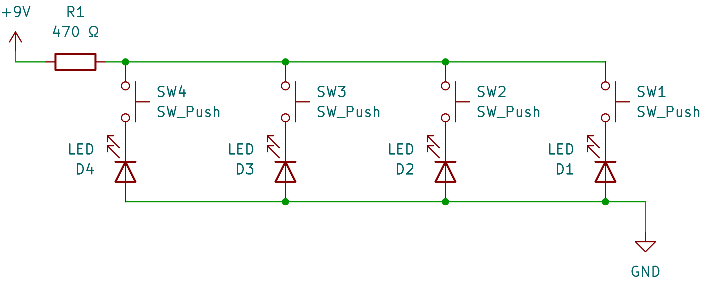
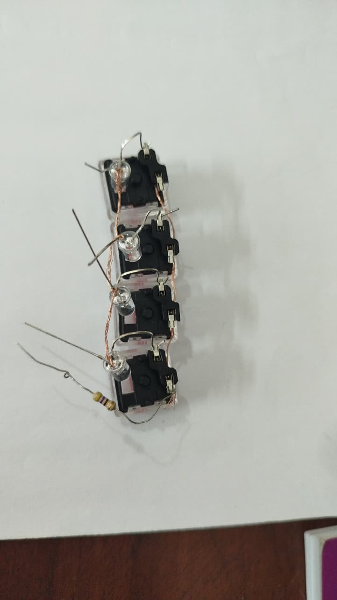
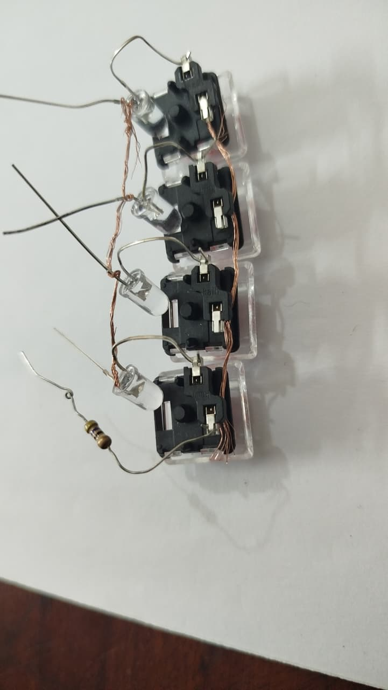
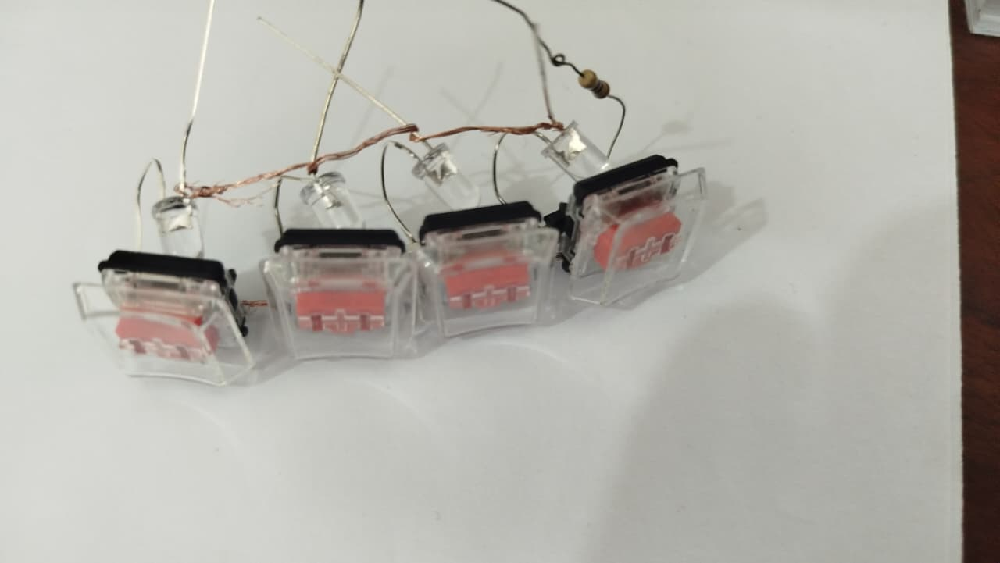

# Clickies
An extremely simple choc key fidget toy

This is an extremely easy and simple fidget toy. It only just really connects switches and LEDs. I'm using the standard cheap LEDs here cause they're really cheap and easy to find. While these LEDs doesn't fit under the choc keys by default but but but I can make it work by scraping a little bit of plastic from that hole. It works cause this doesn't interfere with the working mechanisms of the switch.

The circuit is also really simple and here's the wiring diagram:

For the one I made I just peeled the insulator from a jumper wire and kind of connected the pins by wrapping the wire around them and pressing that with the hotswap socket.

More Pics:

After finishing wiring I used air dry clay to keep everything together and make a nice little soft casing. 

Here's how the current final version looks like:

https://github.com/user-attachments/assets/d40e0147-6267-40e9-9e10-2c23bf32484c

I know my clay skills suck and I even messed up some connections while making the clay casing but hey, it works!

Its honestly a tiny little bit more satisfying than I expected lol. Maybe I should make a better version of this in the future.
